# Emerald Finance Platform - Future Database Schema Documentation

## Overview

This document provides a comprehensive overview of the **future** Emerald Finance Platform database schema, including all proposed improvements and new tables. This represents the target state after all planned enhancements are implemented.

**Database**: PostgreSQL 16+
**ORM**: SQLAlchemy 2.0 (Async)
**Schema Management**: Alembic migrations
**Last Updated**: 2025-11-27
**Status**: Proposed Design

---

## Entity-Relationship Diagram

```mermaid
erDiagram
    %% Core User Management
    users ||--o{ refresh_tokens : "owns"
    users ||--o{ audit_logs : "performed by"
    users ||--o{ taxonomies : "creates"
    users ||--o{ payment_methods : "owns"

    %% Financial Institutions
    financial_institutions ||--o{ accounts : "hosts"
    financial_institutions ||--o{ payment_methods : "issues"

    %% Account Management
    users ||--o{ accounts : "owns"
    account_types ||--o{ accounts : "classifies"
    accounts ||--o{ account_shares : "shared via"
    users ||--o{ account_shares : "shared with"
    accounts ||--o{ payment_methods : "linked to"

    %% Transaction Management
    accounts ||--o{ transactions : "contains"
    transactions ||--o{ transactions : "split into (parent-child)"
    payment_methods ||--o{ transactions : "used for"

    %% Taxonomy System
    taxonomies ||--o{ taxonomy_terms : "contains"
    taxonomy_terms ||--o{ taxonomy_terms : "parent-child"
    taxonomy_terms ||--o{ transaction_taxonomy_terms : "classifies"
    transactions ||--o{ transaction_taxonomy_terms : "classified by"

    %% Budgets
    users ||--o{ budgets : "creates"
    taxonomy_terms ||--o{ budgets : "budgeted"
    accounts ||--o{ budgets : "scoped to"

    %% Legacy (deprecated)
    transactions ||--o{ transaction_tags : "tagged with (deprecated)"

    %% ========== ENTITY DEFINITIONS ==========

    %% User Entity
    users {
        uuid id PK
        string username UK "unique, 50 chars"
        string email UK "unique, 255 chars, indexed"
        string password_hash "Argon2id hash, 255 chars"
        string full_name "nullable, 255 chars"
        boolean is_active "default true, indexed"
        boolean is_admin "default false, indexed"
        timestamp last_login_at "nullable"
        timestamp created_at "indexed"
        timestamp updated_at
        timestamp deleted_at "soft delete, indexed, nullable"
        uuid created_by "nullable, indexed"
        uuid updated_by "nullable, indexed"
    }

    %% Refresh Token Entity
    refresh_tokens {
        uuid id PK
        string token_hash UK "SHA-256, 64 chars, indexed"
        uuid token_family_id "indexed, for rotation"
        uuid user_id FK "indexed"
        timestamp expires_at "indexed"
        boolean is_revoked "default false, indexed"
        timestamp revoked_at "nullable"
        timestamp created_at "indexed"
    }

    %% Audit Log Entity
    audit_logs {
        uuid id PK
        uuid user_id FK "nullable, indexed"
        enum action "indexed (LOGIN, LOGOUT, CREATE, etc)"
        string entity_type "50 chars, indexed"
        uuid entity_id "nullable, indexed"
        jsonb old_values "nullable"
        jsonb new_values "nullable"
        text description "nullable"
        string ip_address "45 chars (IPv6), nullable, indexed"
        string user_agent "500 chars, nullable"
        string request_id "36 chars (UUID), nullable, indexed"
        enum status "indexed (SUCCESS, FAILURE, PARTIAL)"
        text error_message "nullable"
        jsonb extra_metadata "nullable"
        timestamp created_at "indexed"
    }

    %% Financial Institution Entity (NEW)
    financial_institutions {
        uuid id PK
        string name "200 chars, indexed"
        string short_name "100 chars, indexed"
        string swift_code "11 chars, nullable, unique indexed"
        string routing_number "9 chars, nullable, unique indexed"
        string country_code "2 chars ISO 3166-1, indexed"
        enum institution_type "indexed (bank, credit_union, etc)"
        string logo_url "500 chars, nullable"
        string website_url "500 chars, nullable"
        boolean is_active "default true, indexed"
        timestamp created_at
        timestamp updated_at
    }

    %% Payment Method Entity (NEW)
    payment_methods {
        uuid id PK
        uuid user_id FK "indexed"
        uuid account_id FK "nullable, indexed, linked account"
        uuid financial_institution_id FK "nullable, indexed"
        enum method_type "indexed (credit_card, debit_card, etc)"
        string name "100 chars, user-defined"
        string last_four_digits "4 chars, nullable"
        string card_network "50 chars, nullable (Visa, Mastercard, etc)"
        int expiry_month "nullable, 1-12"
        int expiry_year "nullable, YYYY"
        decimal credit_limit "15,2 precision, nullable"
        boolean is_primary "default false"
        string notes "500 chars, nullable"
        timestamp created_at
        timestamp updated_at
        timestamp deleted_at "soft delete, nullable"
        uuid created_by "nullable"
        uuid updated_by "nullable"
    }

    %% Account Type Entity (NEW - replaces enum)
    account_types {
        uuid id PK
        uuid user_id FK "nullable, NULL for system types"
        string key "50 chars, indexed (checking, savings, hsa, etc)"
        string name "100 chars, display name"
        string description "500 chars, nullable"
        string icon "50 chars, nullable"
        boolean is_system "default false, indexed"
        boolean is_active "default true, indexed"
        int sort_order "default 0"
        timestamp created_at
        timestamp updated_at
    }

    %% Account Entity
    accounts {
        uuid id PK
        uuid user_id FK "indexed, owner"
        uuid account_type_id FK "indexed, type"
        uuid financial_institution_id FK "nullable, indexed"
        string account_name "100 chars, indexed"
        string currency "3 chars ISO4217, indexed, CHECK regex"
        decimal opening_balance "15,2 precision"
        decimal current_balance "15,2 precision"
        boolean is_active "default true, indexed"
        string icon_url "500 chars, nullable"
        text iban "encrypted, nullable"
        string iban_last_four "4 chars, nullable"
        string notes "500 chars, nullable"
        timestamp created_at "indexed"
        timestamp updated_at
        timestamp deleted_at "soft delete, indexed, nullable"
        uuid created_by "nullable, indexed"
        uuid updated_by "nullable, indexed"
    }

    %% Account Share Entity
    account_shares {
        uuid id PK
        uuid account_id FK "indexed"
        uuid user_id FK "indexed"
        enum permission_level "indexed (owner, editor, viewer)"
        timestamp created_at "indexed"
        timestamp updated_at
        timestamp deleted_at "soft delete, indexed, nullable"
        uuid created_by "nullable, indexed"
        uuid updated_by "nullable, indexed"
    }

    %% Taxonomy Entity (NEW - replaces tags)
    taxonomies {
        uuid id PK
        uuid user_id FK "indexed, owner"
        string name "100 chars, indexed (Categories, Trips, Projects)"
        string description "500 chars, nullable"
        string icon "50 chars, nullable"
        boolean is_system "default false, indexed"
        int sort_order "default 0"
        timestamp created_at
        timestamp updated_at
        timestamp deleted_at "soft delete, nullable"
        uuid created_by "nullable"
        uuid updated_by "nullable"
    }

    %% Taxonomy Term Entity (NEW)
    taxonomy_terms {
        uuid id PK
        uuid taxonomy_id FK "indexed"
        uuid parent_term_id FK "nullable, indexed, self-reference"
        string name "100 chars, indexed (Groceries, Venezia 2024)"
        string description "500 chars, nullable"
        string icon "50 chars, nullable"
        int sort_order "default 0"
        timestamp created_at
        timestamp updated_at
        timestamp deleted_at "soft delete, nullable"
        uuid created_by "nullable"
        uuid updated_by "nullable"
    }

    %% Transaction Entity
    transactions {
        uuid id PK
        uuid account_id FK "indexed"
        uuid parent_transaction_id FK "nullable, indexed, for splits"
        uuid payment_method_id FK "nullable, indexed, NEW"
        date transaction_date "indexed"
        date value_date "nullable"
        decimal amount "15,2 precision, can be zero"
        string currency "3 chars ISO4217, CHECK regex"
        string original_concept "500 chars, NEW immutable"
        string modified_concept "500 chars, nullable, NEW user-modified"
        string merchant "100 chars, nullable, free text"
        string location_name "200 chars, nullable, NEW"
        enum status "NEW indexed (pending, cleared, reconciled, void)"
        text notes "nullable, NEW user notes"
        timestamp created_at "indexed"
        timestamp updated_at
        timestamp deleted_at "soft delete, indexed, nullable"
        uuid created_by "nullable, indexed"
        uuid updated_by "nullable, indexed"
    }

    %% Transaction Taxonomy Terms (NEW - junction table)
    transaction_taxonomy_terms {
        uuid id PK
        uuid transaction_id FK "indexed"
        uuid taxonomy_term_id FK "indexed"
        timestamp created_at
    }

    %% Transaction Tag Entity (DEPRECATED)
    transaction_tags {
        uuid id PK
        uuid transaction_id FK "indexed"
        string tag "50 chars, lowercased, indexed"
        timestamp created_at
    }

    %% Budget Entity (NEW)
    budgets {
        uuid id PK
        uuid user_id FK "indexed"
        uuid taxonomy_term_id FK "indexed, what to budget"
        uuid account_id FK "nullable, indexed, optional scope"
        string name "200 chars"
        decimal amount "15,2 precision, budget limit"
        string currency "3 chars ISO4217"
        enum period "indexed (daily, weekly, monthly, etc)"
        date start_date "indexed"
        date end_date "nullable, NULL for recurring"
        decimal alert_threshold "15,2 precision, nullable"
        boolean rollover_unused "default false"
        boolean is_active "default true, indexed"
        timestamp created_at
        timestamp updated_at
        timestamp deleted_at "soft delete, nullable"
        uuid created_by "nullable"
        uuid updated_by "nullable"
    }
```



---

## Table Details

### 1. **users**

**Purpose**: Core user authentication and profile management

**Mixins Applied**:
- `TimestampMixin` (created_at, updated_at)
- `SoftDeleteMixin` (deleted_at)
- `AuditFieldsMixin` (created_by, updated_by)

**Key Features**:
- **Argon2id password hashing**: NIST-recommended, memory-hard algorithm
- **Soft delete**: Users are never physically deleted (compliance requirement)
- **Unique constraints**: Email and username remain unique even after deletion
- **Admin flag**: `is_admin` for administrative privileges (superadmin access)

**Indexes**:
- `username` (unique, for login)
- `email` (unique, for login and lookup)
- `is_active` (for filtering active users)
- `is_admin` (for admin-only queries)
- `created_at` (for sorting)
- `deleted_at` (for soft delete filtering)
- `created_by`, `updated_by` (for audit queries)

**Relationships**:
- `refresh_tokens`: One-to-many (user has multiple tokens)
- `accounts`: One-to-many (user owns multiple accounts)
- `account_shares`: One-to-many (user can access shared accounts)
- `payment_methods`: One-to-many (user has multiple payment methods)
- `taxonomies`: One-to-many (user creates custom taxonomies)
- `budgets`: One-to-many (user creates budgets)

**Important Notes**:
- Email and username uniqueness applies globally (not partial index)
- Password hash uses Argon2id with parameters: time_cost=2, memory_cost=65536, parallelism=1
- `last_login_at` tracks user activity for security monitoring

---

### 2. **refresh_tokens**

**Purpose**: JWT refresh token storage with rotation and reuse detection

**Key Features**:
- **SHA-256 token hashing**: Tokens stored as hashes, not plain text
- **Token families**: Tracks rotation chains via `token_family_id`
- **Reuse detection**: If revoked token used, entire family revoked
- **Automatic expiration**: Default 7-day expiry

**Indexes**:
- `token_hash` (unique, for token lookup)
- `token_family_id` (for family revocation)
- `user_id` (for user's tokens)
- `expires_at` (for cleanup jobs)
- `is_revoked` (for filtering valid tokens)
- Composite: `(user_id, is_revoked, expires_at)` for finding valid tokens
- Composite: `(token_family_id, is_revoked)` for family queries
- Composite: `(expires_at, is_revoked)` for cleanup

**Token Rotation Flow**:
1. Login: Create token with new `token_family_id`
2. Refresh: Revoke old token, create new with same `token_family_id`
3. Reuse detected: Revoke all tokens in family
4. Logout: Revoke specific token
5. Password change: Revoke all user's tokens

---

### 3. **audit_logs**

**Purpose**: Immutable audit trail for compliance (GDPR, SOX, PCI DSS)

**Key Features**:
- **Write-once**: Logs cannot be modified or deleted after creation
- **JSONB change tracking**: `old_values` and `new_values` for data modifications
- **Request correlation**: `request_id` for tracing requests
- **7-year retention**: Regulatory compliance requirement

**Indexes**:
- `user_id` (for user's audit history)
- `action` (for filtering by action type)
- `entity_type`, `entity_id` (for entity audit trail)
- `ip_address` (for security monitoring)
- `request_id` (for request correlation)
- `status` (for failure monitoring)
- `created_at` (for time-based queries)
- Composite: `(user_id, created_at)` for user audit logs
- Composite: `(entity_type, entity_id, created_at)` for entity audit trail
- Composite: `(action, created_at)` for action-based queries
- Composite: `(request_id, created_at)` for request correlation
- Partial: `(status, created_at) WHERE status = 'FAILURE'` for failures

**Audit Actions**:
- Authentication: LOGIN, LOGOUT, LOGIN_FAILED, PASSWORD_CHANGE, TOKEN_REFRESH
- CRUD: CREATE, READ, UPDATE, DELETE
- Transactions: SPLIT_TRANSACTION, JOIN_TRANSACTION
- Authorization: PERMISSION_GRANT, PERMISSION_REVOKE
- Administrative: ACCOUNT_ACTIVATE, ACCOUNT_DEACTIVATE, ACCOUNT_LOCK, ACCOUNT_UNLOCK
- Security: RATE_LIMIT_EXCEEDED, INVALID_TOKEN, PERMISSION_DENIED

---

### 4. **financial_institutions** (NEW)

**Purpose**: Master data for banks, credit unions, brokerages, and fintech companies

**Mixins Applied**:
- `TimestampMixin` (created_at, updated_at)

**Key Features**:
- **Standardized bank data**: Eliminates free-text bank names
- **International support**: SWIFT codes, routing numbers, country codes
- **Enrichment ready**: Logo URLs, website URLs for UI enhancement
- **Type classification**: Distinguishes banks, credit unions, brokerages, fintech

**Indexes**:
- `name` (for searching)
- `short_name` (for display/searching)
- `swift_code` (unique partial index WHERE NOT NULL)
- `routing_number` (unique partial index WHERE NOT NULL)
- `country_code` (for filtering by country)
- `institution_type` (for filtering by type)
- `is_active` (for filtering active institutions)

**Relationships**:
- `accounts`: One-to-many (institution hosts many accounts)
- `payment_methods`: One-to-many (institution issues many cards/methods)

**Examples**:
- JPMorgan Chase Bank (bank, US, routing: 021000021)
- Vanguard (brokerage, US)
- Revolut (fintech, GB)
- Navy Federal Credit Union (credit_union, US)

**Benefits**:
- No more "Chase", "chase", "Chase Bank" duplicates
- Easy aggregation: "All my Chase accounts"
- Bank logos in UI automatically
- Support for international banks with SWIFT codes
- Track routing numbers for ACH transfers

---

### 5. **payment_methods** (NEW)

**Purpose**: Track financial instruments (cards, wallets) used for transactions

**Mixins Applied**:
- `TimestampMixin` (created_at, updated_at)
- `SoftDeleteMixin` (deleted_at)
- `AuditFieldsMixin` (created_by, updated_by)

**Key Features**:
- **Multi-instrument support**: Credit cards, debit cards, digital wallets, cash, checks
- **Card metadata**: Network, expiration, last 4 digits, credit limits
- **Institution linkage**: Tracks which bank issued the card
- **Account linkage**: Optional link to account (e.g., debit card → checking account)
- **Primary method**: Flag for default payment method

**Indexes**:
- `user_id` (for user's payment methods)
- `account_id` (for account's linked methods)
- `financial_institution_id` (for institution's issued methods)
- `method_type` (for filtering by type)
- Partial unique: `(user_id) WHERE is_primary = true AND deleted_at IS NULL` (one primary per user)

**Relationships**:
- `user`: Many-to-one (user owns payment methods)
- `account`: Many-to-one (optional linked account)
- `financial_institution`: Many-to-one (issuing institution)
- `transactions`: One-to-many (method used for transactions)

**Payment Method Types**:
- `credit_card`: Credit cards (track limits, rewards)
- `debit_card`: Debit cards (linked to checking/savings)
- `bank_transfer`: Direct bank transfers/ACH
- `digital_wallet`: Apple Pay, Google Pay, PayPal, Venmo
- `cash`: Cash transactions
- `check`: Paper checks
- `other`: Other payment methods

**Use Case Example**:
```
User has:
  - Chase Checking Account (account)
  - Chase Debit Card ending in 1234 (payment_method, linked to checking)
  - Chase Sapphire Reserve Credit Card (separate account)
  - Chase Sapphire card ending in 5678 (payment_method)

Transaction: "Groceries at Whole Foods - $100"
  - account_id: Chase Sapphire Credit Card Account (where balance is tracked)
  - payment_method_id: Chase Sapphire card ending in 5678 (which card was used)
```

**Benefits**:
- Track which specific card was used
- Monitor credit limits and utilization
- Track card expiration dates
- Know which cards earn rewards
- Support for multiple cards per account

---

### 6. **account_types** (NEW - replaces AccountType enum)

**Purpose**: Flexible account type classification with support for custom types

**Mixins Applied**:
- `TimestampMixin` (created_at, updated_at)

**Key Features**:
- **System types**: Built-in types (checking, savings, investment, other)
- **Custom types**: User-defined types (HSA, 529 Plan, Crypto Wallet, etc.)
- **Metadata**: Icons, descriptions for rich UI
- **Deactivation**: Can disable types without code changes

**Indexes**:
- `user_id` (for custom types)
- `key` (for lookup)
- Partial unique: `(key) WHERE is_system = true` (system types globally unique)
- Partial unique: `(user_id, key) WHERE is_system = false AND user_id IS NOT NULL` (custom types unique per user)
- `is_system` (for filtering system vs custom)
- `is_active` (for filtering active types)

**Constraints**:
- System types must have `user_id = NULL`
- Custom types must have `user_id` set
- Enforced by CHECK constraint

**System Types (Seeded)**:
- `checking`: Checking/current accounts
- `savings`: Savings accounts
- `investment`: Investment/brokerage accounts
- `other`: Catch-all for uncategorized

**Custom Type Examples**:
- `hsa`: Health Savings Account
- `529`: 529 College Savings Plan
- `crypto`: Cryptocurrency Wallet
- `pension`: Pension/Retirement Account
- `loan`: Loan Account (track debt)

**Benefits**:
- Users can create custom account types
- No code changes needed for new types
- Rich metadata (icons, descriptions)
- Can disable obsolete types

---

### 7. **accounts**

**Purpose**: Financial account management with multi-currency and metadata support

**Mixins Applied**:
- `TimestampMixin` (created_at, updated_at)
- `SoftDeleteMixin` (deleted_at)
- `AuditFieldsMixin` (created_by, updated_by)

**Key Features**:
- **Multi-currency**: ISO 4217 currency codes (USD, EUR, GBP, etc.)
- **Balance tracking**: `opening_balance` + `current_balance`
- **Flexible typing**: Links to `account_types` table
- **Institution linkage**: Links to `financial_institutions` table
- **Metadata**: Icon, encrypted IBAN, notes
- **Soft delete**: Preserves transaction history after account deletion
- **Account sharing**: Via `account_shares` relationship

**Changes from Current Schema**:
- ✅ ADDED: `account_type_id` (FK to account_types)
- ✅ ADDED: `financial_institution_id` (FK to financial_institutions)
- ❌ REMOVED: `account_type` (enum - replaced by FK)
- ❌ REMOVED: `bank_name` (string - replaced by FK)
- ❌ REMOVED: `color_hex` (not best practice)

**Indexes**:
- `user_id` (for user's accounts)
- `account_type_id` (for filtering by type)
- `financial_institution_id` (for filtering by institution)
- `account_name` (for searching)
- `currency` (for currency-based queries)
- `is_active` (for filtering active accounts)
- `created_at` (for sorting)
- `deleted_at` (for soft delete filtering)
- Partial unique: `(user_id, LOWER(account_name)) WHERE deleted_at IS NULL`

**Constraints**:
- `currency` CHECK: Must match regex `^[A-Z]{3}$` (ISO 4217 format)

**Relationships**:
- `owner`: Many-to-one (user owns account)
- `account_type`: Many-to-one (account type classification)
- `financial_institution`: Many-to-one (hosting institution)
- `shares`: One-to-many (account sharing)
- `transactions`: One-to-many (account transactions)
- `payment_methods`: One-to-many (linked payment methods)
- `budgets`: One-to-many (account-specific budgets)

**Balance Calculation**:
- Phase 2: `current_balance = opening_balance` (no transactions yet)
- Phase 3: `current_balance = opening_balance + SUM(transactions WHERE deleted_at IS NULL)`

---

### 8. **account_shares**

**Purpose**: Account sharing with permission-level based access control

**Mixins Applied**:
- `TimestampMixin` (created_at, updated_at)
- `SoftDeleteMixin` (deleted_at)
- `AuditFieldsMixin` (created_by, updated_by)

**Key Features**:
- **Permission hierarchy**: OWNER > EDITOR > VIEWER
- **Soft delete (revocation)**: Revoking sets `deleted_at`
- **Unique constraint**: One active share per user per account

**Indexes**:
- `account_id` (for account's shares)
- `user_id` (for user's shared accounts)
- `permission_level` (for permission queries)
- Composite: `(account_id, user_id, deleted_at)` for permission lookups
- Partial unique: `(account_id, user_id) WHERE deleted_at IS NULL`

**Permission Levels**:

| Permission | Owner | Editor | Viewer |
|------------|:-----:|:------:|:------:|
| View account details | ✓ | ✓ | ✓ |
| View balance | ✓ | ✓ | ✓ |
| Update account name | ✓ | ✓ | ✗ |
| Update is_active | ✓ | ✗ | ✗ |
| Delete account | ✓ | ✗ | ✗ |
| Share account | ✓ | ✗ | ✗ |
| Update permissions | ✓ | ✗ | ✗ |
| Revoke access | ✓ | ✗ | ✗ |

---

### 9. **taxonomies** (NEW - replaces tags system)

**Purpose**: User-specific classification schemes for organizing transactions

**Mixins Applied**:
- `TimestampMixin` (created_at, updated_at)
- `SoftDeleteMixin` (deleted_at)
- `AuditFieldsMixin` (created_by, updated_by)

**Key Features**:
- **Multiple taxonomies**: Users can create independent classification systems
- **System taxonomies**: Predefined "Categories" taxonomy per user (customizable)
- **Flexible naming**: "Categories", "Trips", "Projects", "Clients", "Tax Years", etc.
- **Hierarchical support**: Terms within taxonomies can have parent-child relationships

**Indexes**:
- `user_id` (for user's taxonomies)
- `name` (for searching)
- `is_system` (for filtering system vs custom)
- Partial unique: `(user_id, name) WHERE deleted_at IS NULL` (unique name per user)

**Relationships**:
- `user`: Many-to-one (user owns taxonomy)
- `terms`: One-to-many (taxonomy contains terms)

**Examples**:
```
User A creates:
  1. "Categories" (system: true) - Default expense categorization
  2. "Trips" (system: false) - Travel expense tracking
  3. "Tax" (system: false) - Tax deductibility classification

User B creates:
  1. "Categories" (system: true) - Their own version
  2. "Projects" (system: false) - Project-based accounting
  3. "Clients" (system: false) - Client billing
```

**Benefits**:
- Unlimited categorization flexibility
- Multiple classification schemes per transaction
- User-specific taxonomies (no shared data between users)
- System provides sensible defaults

---

### 10. **taxonomy_terms** (NEW)

**Purpose**: Individual values/categories within taxonomies (hierarchical)

**Mixins Applied**:
- `TimestampMixin` (created_at, updated_at)
- `SoftDeleteMixin` (deleted_at)
- `AuditFieldsMixin` (created_by, updated_by)

**Key Features**:
- **Hierarchical structure**: Parent-child relationships for nested categorization
- **Per-taxonomy uniqueness**: Same term name can exist in different taxonomies
- **Icon support**: Visual identification
- **Ordering**: Custom sort order within parent

**Indexes**:
- `taxonomy_id` (for taxonomy's terms)
- `parent_term_id` (for hierarchy queries)
- `name` (for searching)
- Partial unique: `(taxonomy_id, name) WHERE deleted_at IS NULL` (unique per taxonomy)

**Constraints**:
- No self-reference: `id != parent_term_id`

**Relationships**:
- `taxonomy`: Many-to-one (term belongs to taxonomy)
- `parent_term`: Many-to-one (parent in hierarchy)
- `child_terms`: One-to-many (children in hierarchy)
- `budgets`: One-to-many (budgets for this term)

**Hierarchy Example**:
```
Taxonomy: "Categories"
├── Food (parent_term_id: NULL)
│   ├── Groceries (parent_term_id: Food.id)
│   │   ├── Organic (parent_term_id: Groceries.id)
│   │   └── Regular (parent_term_id: Groceries.id)
│   └── Restaurants (parent_term_id: Food.id)
│       ├── Fast Food (parent_term_id: Restaurants.id)
│       └── Fine Dining (parent_term_id: Restaurants.id)
├── Transportation (parent_term_id: NULL)
│   ├── Gas (parent_term_id: Transportation.id)
│   └── Public Transit (parent_term_id: Transportation.id)

Taxonomy: "Trips"
├── Venezia 2024 (parent_term_id: NULL)
├── Portugal 2025 (parent_term_id: NULL)
└── Tokyo 2026 (parent_term_id: NULL)
```

**Benefits**:
- Unlimited depth hierarchy
- Flexible categorization
- Roll-up reporting (sum all Food expenses)
- Visual organization with icons

---

### 11. **transactions**

**Purpose**: Financial transaction tracking with splitting, tagging, and enhanced metadata

**Mixins Applied**:
- `TimestampMixin` (created_at, updated_at)
- `SoftDeleteMixin` (deleted_at)
- `AuditFieldsMixin` (created_by, updated_by)

**Key Features**:
- **Parent-child splits**: `parent_transaction_id` for transaction splitting
- **Dual concepts**: Immutable `original_concept` + editable `modified_concept`
- **Payment method tracking**: Links to `payment_methods` table
- **Status tracking**: pending, cleared, reconciled, void
- **Location tracking**: `location_name` for where transaction occurred
- **Enhanced notes**: Separate `notes` field for user annotations
- **Taxonomy classification**: Links to multiple taxonomy terms
- **Zero-amount allowed**: For fee waivers, promotional credits, etc.

**Changes from Current Schema**:
- ✅ ADDED: `payment_method_id` (FK to payment_methods)
- ✅ ADDED: `original_concept` (immutable original description)
- ✅ ADDED: `modified_concept` (user's modified description)
- ✅ ADDED: `location_name` (where transaction occurred)
- ✅ ADDED: `status` (transaction status enum)
- ✅ ADDED: `notes` (user notes, replaces user_notes)
- ❌ REMOVED: `description` (replaced by original_concept)
- ❌ REMOVED: `user_notes` (replaced by notes)
- ❌ REMOVED: `transaction_type` (income/expense/transfer enum)

**Indexes**:
- `account_id` (for account's transactions)
- `payment_method_id` (for payment method's transactions)
- `parent_transaction_id` (for split queries)
- `transaction_date` (for date range queries)
- `status` (for filtering by status)
- `deleted_at` (for soft delete filtering)
- Composite: `(account_id, transaction_date)` for common queries
- Composite: `(account_id, deleted_at)` for balance calculations
- GIN: `merchant` (for fuzzy search with pg_trgm)

**Constraints**:
- `currency` CHECK: Must match regex `^[A-Z]{3}$` (ISO 4217 format)

**Transaction Status**:
- `pending`: Not yet cleared by bank
- `cleared`: Cleared by bank (default)
- `reconciled`: User verified and reconciled
- `void`: Voided/cancelled transaction

**Concept Fields**:
- `original_concept`: Immutable, from bank/CSV (e.g., "WHOLEFDS 1234 SEATTLE WA")
- `modified_concept`: User-friendly version (e.g., "Whole Foods - Weekly Groceries")
- Display: Show `modified_concept` if set, otherwise `original_concept`

**Relationships**:
- `account`: Many-to-one (transaction belongs to account)
- `payment_method`: Many-to-one (payment method used)
- `parent_transaction`: Many-to-one (parent if split)
- `child_transactions`: One-to-many (splits of this transaction)
- `taxonomy_terms`: Many-to-many via `transaction_taxonomy_terms`
- `tags`: One-to-many (deprecated, for backward compatibility)

**Transaction Splitting**:
- Parent transaction has `parent_transaction_id = NULL`
- Child transactions have `parent_transaction_id = parent.id`
- Sum of child amounts must equal parent amount
- At least 2 splits required
- Cannot split a child transaction (no nested splits)

**Balance Updates**:
- Creating: `current_balance += amount`
- Updating: `current_balance += (new_amount - old_amount)`
- Deleting: `current_balance -= amount`
- All updates atomic (same DB transaction)

---

### 12. **transaction_taxonomy_terms** (NEW - junction table)

**Purpose**: Many-to-many relationship between transactions and taxonomy terms

**Mixins Applied**:
- `TimestampMixin` (created_at only)

**Key Features**:
- **Multiple classifications**: One transaction can have terms from multiple taxonomies
- **Unique constraint**: Can't assign same term twice to one transaction

**Indexes**:
- `transaction_id` (for transaction's terms)
- `taxonomy_term_id` (for term's transactions)
- Unique: `(transaction_id, taxonomy_term_id)`

**Example**:
```
Transaction: "Dinner at Italian Restaurant in Venice - $85"
  Classifications:
    - Categories: Food → Restaurants → Italian
    - Trips: Venezia 2024
    - Budget: Vacation Budget
```

**Benefits**:
- Flexible, multi-dimensional classification
- One transaction visible in multiple reports
- Easy to re-classify without data loss

---

### 13. **transaction_tags** (DEPRECATED)

**Purpose**: Legacy tagging system (being replaced by taxonomies)

**Status**: Deprecated, kept for backward compatibility during migration

**Migration Path**:
1. Create default "Tags" taxonomy per user
2. Migrate tags → taxonomy terms
3. Eventually remove this table

---

### 14. **budgets** (NEW)

**Purpose**: Track spending limits by taxonomy term with alerts

**Mixins Applied**:
- `TimestampMixin` (created_at, updated_at)
- `SoftDeleteMixin` (deleted_at)
- `AuditFieldsMixin` (created_by, updated_by)

**Key Features**:
- **Taxonomy-based**: Budget any taxonomy term (category, trip, project, etc.)
- **Flexible periods**: Daily, weekly, monthly, quarterly, yearly, custom
- **Account scoping**: Optional restriction to specific account
- **Alert thresholds**: Notify when spending reaches threshold
- **Rollover support**: Unused budget can roll over to next period
- **Recurring budgets**: `end_date = NULL` for ongoing budgets

**Indexes**:
- `user_id` (for user's budgets)
- `taxonomy_term_id` (for term's budgets)
- `account_id` (for account-specific budgets)
- `period` (for filtering by period)
- `start_date` (for date-based queries)
- `is_active` (for filtering active budgets)

**Constraints**:
- `currency` CHECK: Must match regex `^[A-Z]{3}$` (ISO 4217 format)
- `amount` CHECK: Must be positive
- `alert_threshold` CHECK: Must be <= amount

**Relationships**:
- `user`: Many-to-one (user owns budget)
- `taxonomy_term`: Many-to-one (what to budget)
- `account`: Many-to-one (optional account scope)

**Budget Periods**:
- `daily`: Daily budget
- `weekly`: Weekly budget
- `monthly`: Monthly budget (most common)
- `quarterly`: Quarterly budget
- `yearly`: Annual budget
- `custom`: Custom date range (start_date to end_date)

**Examples**:
```
Budget 1: Monthly Groceries
  - taxonomy_term: "Categories → Food → Groceries"
  - amount: $600/month
  - period: monthly
  - alert_threshold: $500 (alert at 83%)

Budget 2: Venezia Trip Budget
  - taxonomy_term: "Trips → Venezia 2024"
  - amount: $5000
  - period: custom
  - start_date: 2024-05-01
  - end_date: 2024-05-15

Budget 3: Business Account Expenses
  - taxonomy_term: "Categories → Business"
  - account: Business Checking Account
  - amount: $10000/month
  - period: monthly
```

**Benefits**:
- Budget any classification (categories, trips, projects)
- Account-specific or global budgets
- Flexible time periods
- Proactive alerts
- Rollover support

---

## Relationships Summary

### One-to-Many Relationships

1. **users → accounts**
   - User owns multiple accounts
   - FK: `accounts.user_id → users.id`
   - Cascade: ON DELETE CASCADE

2. **users → refresh_tokens**
   - User has multiple refresh tokens
   - FK: `refresh_tokens.user_id → users.id`
   - Cascade: ON DELETE CASCADE

3. **users → audit_logs**
   - User performed multiple actions
   - FK: `audit_logs.user_id → users.id`
   - Cascade: ON DELETE SET NULL (preserve audit after user deletion)

4. **users → payment_methods**
   - User owns multiple payment methods
   - FK: `payment_methods.user_id → users.id`
   - Cascade: ON DELETE CASCADE

5. **users → taxonomies**
   - User creates multiple taxonomies
   - FK: `taxonomies.user_id → users.id`
   - Cascade: ON DELETE CASCADE

6. **users → budgets**
   - User creates multiple budgets
   - FK: `budgets.user_id → users.id`
   - Cascade: ON DELETE CASCADE

7. **users → account_shares**
   - User has access to multiple shared accounts
   - FK: `account_shares.user_id → users.id`
   - Cascade: ON DELETE CASCADE

8. **financial_institutions → accounts**
   - Institution hosts multiple accounts
   - FK: `accounts.financial_institution_id → financial_institutions.id`
   - Cascade: ON DELETE SET NULL

9. **financial_institutions → payment_methods**
   - Institution issues multiple payment methods
   - FK: `payment_methods.financial_institution_id → financial_institutions.id`
   - Cascade: ON DELETE SET NULL

10. **account_types → accounts**
    - Account type classifies multiple accounts
    - FK: `accounts.account_type_id → account_types.id`
    - Cascade: ON DELETE RESTRICT (can't delete type with accounts)

11. **accounts → transactions**
    - Account contains multiple transactions
    - FK: `transactions.account_id → accounts.id`
    - Cascade: ON DELETE CASCADE

12. **accounts → account_shares**
    - Account shared with multiple users
    - FK: `account_shares.account_id → accounts.id`
    - Cascade: ON DELETE CASCADE

13. **accounts → payment_methods**
    - Account linked to multiple payment methods (optional)
    - FK: `payment_methods.account_id → accounts.id`
    - Cascade: ON DELETE SET NULL

14. **accounts → budgets**
    - Account has multiple budgets (optional scoping)
    - FK: `budgets.account_id → accounts.id`
    - Cascade: ON DELETE CASCADE

15. **payment_methods → transactions**
    - Payment method used for multiple transactions
    - FK: `transactions.payment_method_id → payment_methods.id`
    - Cascade: ON DELETE SET NULL

16. **taxonomies → taxonomy_terms**
    - Taxonomy contains multiple terms
    - FK: `taxonomy_terms.taxonomy_id → taxonomies.id`
    - Cascade: ON DELETE CASCADE

17. **taxonomy_terms → budgets**
    - Taxonomy term has multiple budgets
    - FK: `budgets.taxonomy_term_id → taxonomy_terms.id`
    - Cascade: ON DELETE CASCADE

### Many-to-Many Relationships

1. **transactions ↔ taxonomy_terms** (via transaction_taxonomy_terms)
   - Transactions can be classified by multiple taxonomy terms
   - Taxonomy terms can classify multiple transactions
   - Junction table: `transaction_taxonomy_terms`
   - Cascade: ON DELETE CASCADE on both FKs

### Self-Referencing Relationships

1. **transactions → transactions** (parent-child splits)
   - Parent transaction split into child transactions
   - FK: `transactions.parent_transaction_id → transactions.id`
   - Cascade: ON DELETE SET NULL

2. **taxonomy_terms → taxonomy_terms** (hierarchy)
   - Parent term contains child terms
   - FK: `taxonomy_terms.parent_term_id → taxonomy_terms.id`
   - Cascade: ON DELETE CASCADE

---

## Database Enums

### AuditAction (audit_action_enum)
```
LOGIN, LOGOUT, LOGIN_FAILED, PASSWORD_CHANGE, TOKEN_REFRESH,
CREATE, READ, UPDATE, DELETE,
SPLIT_TRANSACTION, JOIN_TRANSACTION,
PERMISSION_GRANT, PERMISSION_REVOKE,
ACCOUNT_ACTIVATE, ACCOUNT_DEACTIVATE, ACCOUNT_LOCK, ACCOUNT_UNLOCK,
RATE_LIMIT_EXCEEDED, INVALID_TOKEN, PERMISSION_DENIED
```

### AuditStatus (audit_status_enum)
```
SUCCESS, FAILURE, PARTIAL
```

### InstitutionType (institutiontype) - NEW
```
bank, credit_union, brokerage, fintech, other
```

### PaymentMethodType (paymentmethodtype) - NEW
```
credit_card, debit_card, bank_transfer, digital_wallet, cash, check, other
```

### PermissionLevel (permissionlevel)
```
owner, editor, viewer
```

### BudgetPeriod (budgetperiod) - NEW
```
daily, weekly, monthly, quarterly, yearly, custom
```

### TransactionStatus (transactionstatus) - NEW
```
pending, cleared, reconciled, void
```

### REMOVED Enums
- ~~AccountType~~ (converted to `account_types` table)
- ~~TransactionType~~ (removed - infer from amount sign or taxonomy)

---

## Soft Delete Strategy

All models with `SoftDeleteMixin` use soft delete:
- **Tables**: users, accounts, account_shares, transactions, payment_methods, taxonomies, taxonomy_terms, budgets
- **Behavior**: `deleted_at` timestamp set instead of physical deletion
- **Filtering**: `BaseRepository` automatically filters `WHERE deleted_at IS NULL`
- **Uniqueness**: Partial unique indexes used: `WHERE deleted_at IS NULL`

**Compliance Reasons**:
- **GDPR**: 7-year data retention for financial records
- **SOX**: Audit trail preservation
- **Accidental deletion recovery**
- **Transaction history integrity**

**Important**: `transaction_taxonomy_terms`, `refresh_tokens`, `audit_logs`, `financial_institutions`, `account_types` use hard delete (no soft delete mixin).

---

## Indexing Strategy

### Primary Indexes (All Tables)
- Primary key: `id` (UUID) - clustered index

### Foreign Key Indexes
- All foreign keys indexed for join performance

### Lookup Indexes
- Unique constraints: email, username, token_hash, SWIFT codes, routing numbers
- Common filters: is_active, is_admin, is_system, status, period
- Soft delete: deleted_at (for filtering)

### Composite Indexes
- `(user_id, created_at)` - User's audit logs sorted by date
- `(account_id, transaction_date)` - Account transactions by date
- `(account_id, deleted_at)` - Balance calculations
- `(taxonomy_id, name)` - Unique terms per taxonomy

### Partial Indexes
- `(user_id, LOWER(account_name)) WHERE deleted_at IS NULL` - Unique active account names per user
- `(account_id, user_id) WHERE deleted_at IS NULL` - Unique active shares
- `(status, created_at) WHERE status = 'FAILURE'` - Failed audit logs
- `(key) WHERE is_system = true` - Unique system account types
- `(user_id) WHERE is_primary = true AND deleted_at IS NULL` - One primary payment method per user

### Full-Text Indexes (GIN)
- `merchant` - Fuzzy search with pg_trgm

---

## Security Considerations

### Password Security
- **Algorithm**: Argon2id (NIST-recommended, memory-hard)
- **Parameters**: time_cost=2, memory_cost=65536, parallelism=1
- **Storage**: Never store plain passwords, only hashes

### Token Security
- **Refresh tokens**: Stored as SHA-256 hashes
- **Token rotation**: New token on every refresh
- **Reuse detection**: Revoke family if revoked token used
- **Expiration**: 7-day default, configurable

### Encryption
- **IBAN**: Encrypted at rest (full account number)
- **Environment**: Encryption key in environment variable
- **Display**: Last 4 digits stored in plaintext for UI

### Audit Logging
- **Immutable**: Cannot modify/delete audit logs
- **Comprehensive**: All state-changing operations logged
- **Retention**: 7-year minimum for compliance

---

## Migration Management

### Alembic Configuration
- **Auto-generate**: `uv run alembic revision --autogenerate -m "description"`
- **Apply**: `uv run alembic upgrade head`
- **Review**: Always review auto-generated migrations - Alembic can miss constraints, indexes

### Migration Guidelines
1. Never edit committed migrations
2. Test migrations on copy of production data
3. Migrations are idempotent (can run multiple times safely)
4. Use `op.execute()` for custom SQL (enums, constraints)
5. Document breaking changes in migration docstring

### Superuser Creation
- Created automatically in migrations (not via API)
- Uses `SUPERADMIN_EMAIL` and `SUPERADMIN_PASSWORD` from `.env`
- Idempotent - skips if admin already exists
- Has `is_admin=True` flag for administrative access

---

## Performance Optimization

### Connection Pooling
- **Configuration**: 5 permanent + 10 overflow connections
- **Timeout**: 30 seconds
- **Recycle**: 3600 seconds (1 hour)

### Query Optimization
- **Eager loading**: `selectin` for relationships (avoids N+1)
- **Pagination**: Default 20, max 100 items per page
- **Indexes**: All foreign keys and common filters indexed

### Caching Strategy
- **Redis**: Rate limiting and session storage
- **No ORM caching**: Use Redis for application-level caching

### Balance Calculation
- **Cached**: `current_balance` stored in `accounts` table
- **Updated atomically**: Same DB transaction as transaction insert/update/delete
- **Soft delete aware**: Only counts transactions where `deleted_at IS NULL`

---

## Compliance & Regulatory

### GDPR Compliance
- **Audit trail**: All data access and modifications logged
- **Right to be forgotten**: Soft delete preserves audit trail
- **Data retention**: 7-year minimum for financial records
- **Encryption**: Sensitive data (IBAN) encrypted at rest

### SOX Compliance
- **7-year retention**: Financial transaction history preserved
- **Immutable audit logs**: Cannot modify/delete after creation
- **Change tracking**: old_values/new_values in audit logs

### PCI DSS Compliance (Future)
- **No card storage**: Do not store full card numbers (only last 4 digits)
- **Encryption**: Sensitive data encrypted at rest
- **Audit logging**: All access to cardholder data logged

---

## Database Statistics

### Total Tables: 15
1. users
2. refresh_tokens
3. audit_logs
4. **financial_institutions** (NEW)
5. **payment_methods** (NEW)
6. **account_types** (NEW - replaces enum)
7. accounts
8. account_shares
9. **taxonomies** (NEW)
10. **taxonomy_terms** (NEW)
11. transactions
12. **transaction_taxonomy_terms** (NEW - junction)
13. transaction_tags (deprecated)
14. **budgets** (NEW)
15. alembic_version

### Enums: 7
1. AuditAction (22 values)
2. AuditStatus (3 values)
3. PermissionLevel (3 values)
4. **InstitutionType** (NEW - 5 values)
5. **PaymentMethodType** (NEW - 7 values)
6. **BudgetPeriod** (NEW - 6 values)
7. **TransactionStatus** (NEW - 4 values)

### Removed Enums: 2
- ~~AccountType~~ (converted to table)
- ~~TransactionType~~ (removed entirely)

### Relationships: 20+
- One-to-many: 17
- Many-to-many: 1
- Self-referencing: 2

### Indexes: 60+ (including composite and partial)

---

## Comparison: Current vs Future Schema

### Tables Added: +7
- financial_institutions
- payment_methods
- account_types
- taxonomies
- taxonomy_terms
- transaction_taxonomy_terms
- budgets

### Tables Modified: 2
- accounts (new FKs, removed fields)
- transactions (new fields, removed enum)

### Tables Deprecated: 1
- transaction_tags (replaced by taxonomies)

### Fields Removed from Existing Tables:
- accounts: `account_type` (enum), `bank_name`, `color_hex`
- transactions: `description`, `user_notes`, `transaction_type`

### Fields Added to Existing Tables:
- accounts: `account_type_id`, `financial_institution_id`
- transactions: `payment_method_id`, `original_concept`, `modified_concept`, `location_name`, `status`, `notes`

---

## Migration Phases

### Phase 1: Financial Infrastructure (Weeks 1-2)
- Create `financial_institutions` table
- Create `payment_methods` table
- Migrate `accounts.bank_name` → `financial_institution_id`

### Phase 2: Taxonomies (Weeks 3-4)
- Create `taxonomies`, `taxonomy_terms`, `transaction_taxonomy_terms` tables
- Seed default "Categories" taxonomy per user
- Migrate `transaction_tags` → taxonomy terms

### Phase 3: Budgets (Week 5)
- Create `budgets` table
- Build budget tracking services

### Phase 4: Account Types (Week 6)
- Create `account_types` table
- Migrate enum → table
- Drop old enum

### Phase 5: Enhanced Transactions (Week 7)
- Add new transaction fields
- Migrate existing data
- Drop deprecated fields

### Phase 6: Cleanup (Week 8)
- Drop deprecated tables/fields
- Optimize indexes
- Update documentation

---

## Key Benefits of Future Schema

### Data Quality
- ✅ Standardized financial institutions (no duplicates)
- ✅ Structured categorization (no messy tags)
- ✅ Immutable original data (`original_concept`)
- ✅ Flexible account types

### User Experience
- ✅ Rich metadata (bank logos, icons)
- ✅ Multi-dimensional classification
- ✅ Budget tracking with alerts
- ✅ Payment method tracking
- ✅ Better transaction search

### Reporting & Analytics
- ✅ Aggregate by bank: "All Chase accounts"
- ✅ Aggregate by category hierarchy: "All Food → Restaurants"
- ✅ Multi-taxonomy reports: "Venezia 2024 trip expenses by category"
- ✅ Budget vs actual tracking
- ✅ Payment method analysis

### Scalability
- ✅ Custom account types without code changes
- ✅ Unlimited taxonomies per user
- ✅ Hierarchical categorization
- ✅ International bank support

### Compliance
- ✅ Immutable original concepts
- ✅ Audit trail for all changes
- ✅ 7-year retention
- ✅ Encrypted sensitive data

---

## Conclusion

The future Emerald Finance Platform database schema is designed for:
- **Flexibility**: Custom taxonomies, account types, unlimited categorization
- **Data Quality**: Normalized institutions, structured categories, immutable originals
- **User Experience**: Rich metadata, multi-dimensional classification, budgeting
- **Analytics**: Powerful reporting across institutions, categories, trips, projects
- **Scalability**: UUID primary keys, efficient indexing, hierarchical data
- **Security**: Argon2id password hashing, token rotation, encrypted sensitive data
- **Compliance**: Immutable audit logs, soft deletes, 7-year retention

**Implementation Timeline**: 8 weeks across 6 phases

**Risk Mitigation**:
- Backward compatible migrations
- Keep deprecated fields during transition
- Extensive testing on copy of production data
- Phased rollout with feature flags
- Rollback plans for each phase

---

**Status**: Ready for stakeholder review and approval
**Next Step**: Approve Phase 1 for implementation
