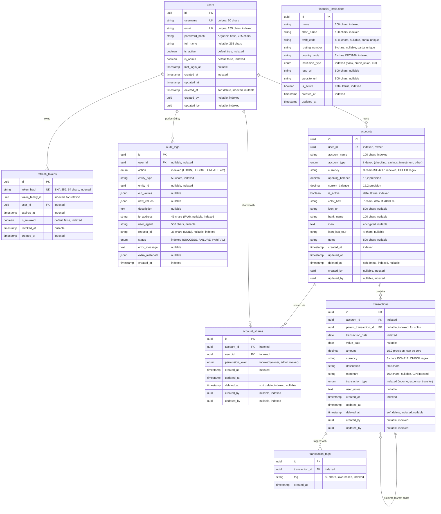

# Emerald Finance Platform - Database Schema Documentation

## Overview

This document provides a comprehensive overview of the Emerald Finance Platform database schema, including all tables, relationships, constraints, and implementation details.

**Database**: PostgreSQL 16+
**ORM**: SQLAlchemy 2.0 (Async)
**Schema Management**: Alembic migrations
**Last Updated**: 2025-11-27

---

## Entity-Relationship Diagram



---

## Table Details

### 1. **users**

**Purpose**: Core user authentication and profile management

**Mixins Applied**:
- `TimestampMixin` (created_at, updated_at)
- `SoftDeleteMixin` (deleted_at)
- `AuditFieldsMixin` (created_by, updated_by)

**Key Features**:
- **Argon2id password hashing**: NIST-recommended, memory-hard algorithm
- **Soft delete**: Users are never physically deleted (compliance requirement)
- **Unique constraints**: Email and username remain unique even after deletion
- **Admin flag**: `is_admin` for administrative privileges (superadmin access)

**Indexes**:
- `username` (unique, for login)
- `email` (unique, for login and lookup)
- `is_active` (for filtering active users)
- `is_admin` (for admin-only queries)
- `created_at` (for sorting)
- `deleted_at` (for soft delete filtering)
- `created_by`, `updated_by` (for audit queries)

**Relationships**:
- `refresh_tokens`: One-to-many (user has multiple tokens)
- `accounts`: One-to-many (user owns multiple accounts)
- `account_shares`: One-to-many (user can access shared accounts)

**Important Notes**:
- Email and username uniqueness applies globally (not partial index)
- Password hash uses Argon2id with parameters: time_cost=2, memory_cost=65536, parallelism=1
- `last_login_at` tracks user activity for security monitoring

---

### 2. **refresh_tokens**

**Purpose**: JWT refresh token storage with rotation and reuse detection

**Key Features**:
- **SHA-256 token hashing**: Tokens stored as hashes, not plain text
- **Token families**: Tracks rotation chains via `token_family_id`
- **Reuse detection**: If revoked token used, entire family revoked
- **Automatic expiration**: Default 7-day expiry

**Indexes**:
- `token_hash` (unique, for token lookup)
- `token_family_id` (for family revocation)
- `user_id` (for user's tokens)
- `expires_at` (for cleanup jobs)
- `is_revoked` (for filtering valid tokens)
- Composite: `(user_id, is_revoked, expires_at)` for finding valid tokens
- Composite: `(token_family_id, is_revoked)` for family queries
- Composite: `(expires_at, is_revoked)` for cleanup

**Token Rotation Flow**:
1. Login: Create token with new `token_family_id`
2. Refresh: Revoke old token, create new with same `token_family_id`
3. Reuse detected: Revoke all tokens in family
4. Logout: Revoke specific token
5. Password change: Revoke all user's tokens

---

### 3. **audit_logs**

**Purpose**: Immutable audit trail for compliance (GDPR, SOX, PCI DSS)

**Key Features**:
- **Write-once**: Logs cannot be modified or deleted after creation
- **JSONB change tracking**: `old_values` and `new_values` for data modifications
- **Request correlation**: `request_id` for tracing requests
- **7-year retention**: Regulatory compliance requirement

**Indexes**:
- `user_id` (for user's audit history)
- `action` (for filtering by action type)
- `entity_type`, `entity_id` (for entity audit trail)
- `ip_address` (for security monitoring)
- `request_id` (for request correlation)
- `status` (for failure monitoring)
- `created_at` (for time-based queries)
- Composite: `(user_id, created_at)` for user audit logs
- Composite: `(entity_type, entity_id, created_at)` for entity audit trail
- Composite: `(action, created_at)` for action-based queries
- Composite: `(request_id, created_at)` for request correlation
- Partial: `(status, created_at) WHERE status = 'FAILURE'` for failures

**Audit Actions**:
- Authentication: LOGIN, LOGOUT, LOGIN_FAILED, PASSWORD_CHANGE, TOKEN_REFRESH
- CRUD: CREATE, READ, UPDATE, DELETE
- Transactions: SPLIT_TRANSACTION, JOIN_TRANSACTION
- Authorization: PERMISSION_GRANT, PERMISSION_REVOKE
- Administrative: ACCOUNT_ACTIVATE, ACCOUNT_DEACTIVATE, ACCOUNT_LOCK, ACCOUNT_UNLOCK
- Security: RATE_LIMIT_EXCEEDED, INVALID_TOKEN, PERMISSION_DENIED

---

### 4. **accounts**

**Purpose**: Financial account management with multi-currency and metadata support

**Mixins Applied**:
- `TimestampMixin` (created_at, updated_at)
- `SoftDeleteMixin` (deleted_at)
- `AuditFieldsMixin` (created_by, updated_by)

**Key Features**:
- **Multi-currency**: ISO 4217 currency codes (USD, EUR, GBP, etc.)
- **Balance tracking**: `opening_balance` + `current_balance`
- **Metadata**: Color, icon, bank name, encrypted IBAN
- **Soft delete**: Preserves transaction history after account deletion
- **Account sharing**: Via `account_shares` relationship

**Indexes**:
- `user_id` (for user's accounts)
- `account_name` (for searching)
- `account_type` (for filtering)
- `currency` (for currency-based queries)
- `is_active` (for filtering active accounts)
- `created_at` (for sorting)
- `deleted_at` (for soft delete filtering)
- Partial unique: `(user_id, LOWER(account_name)) WHERE deleted_at IS NULL`

**Constraints**:
- `currency` CHECK: Must match regex `^[A-Z]{3}$` (ISO 4217 format)

**Account Types**:
- `checking`: Current/checking accounts
- `savings`: Savings accounts
- `investment`: Investment/brokerage accounts
- `other`: User-defined types

**Metadata Fields**:
- `color_hex`: Hex color code for UI display (default: #818E8F)
- `icon_url`: URL or path to account icon
- `bank_name`: Financial institution name
- `iban`: Encrypted IBAN (full account number)
- `iban_last_four`: Last 4 digits of IBAN (plaintext, for display)
- `notes`: User's personal notes about the account

**Balance Calculation**:
- Phase 2: `current_balance = opening_balance` (no transactions yet)
- Phase 3: `current_balance = opening_balance + SUM(transactions WHERE deleted_at IS NULL)`

---

### 5. **account_shares**

**Purpose**: Account sharing with permission-level based access control

**Mixins Applied**:
- `TimestampMixin` (created_at, updated_at)
- `SoftDeleteMixin` (deleted_at)
- `AuditFieldsMixin` (created_by, updated_by)

**Key Features**:
- **Permission hierarchy**: OWNER > EDITOR > VIEWER
- **Soft delete (revocation)**: Revoking sets `deleted_at`
- **Unique constraint**: One active share per user per account

**Indexes**:
- `account_id` (for account's shares)
- `user_id` (for user's shared accounts)
- `permission_level` (for permission queries)
- Composite: `(account_id, user_id, deleted_at)` for permission lookups
- Partial unique: `(account_id, user_id) WHERE deleted_at IS NULL`

**Permission Levels**:

| Permission | Owner | Editor | Viewer |
|------------|:-----:|:------:|:------:|
| View account details | ✓ | ✓ | ✓ |
| View balance | ✓ | ✓ | ✓ |
| Update account name | ✓ | ✓ | ✗ |
| Update is_active | ✓ | ✗ | ✗ |
| Delete account | ✓ | ✗ | ✗ |
| Share account | ✓ | ✗ | ✗ |
| Update permissions | ✓ | ✗ | ✗ |
| Revoke access | ✓ | ✗ | ✗ |

---

### 6. **transactions**

**Purpose**: Financial transaction tracking with splitting and tagging

**Mixins Applied**:
- `TimestampMixin` (created_at, updated_at)
- `SoftDeleteMixin` (deleted_at)
- `AuditFieldsMixin` (created_by, updated_by)

**Key Features**:
- **Parent-child splits**: `parent_transaction_id` for transaction splitting
- **Zero-amount allowed**: For fee waivers, promotional credits, etc.
- **Fuzzy search**: pg_trgm extension for merchant/description search
- **Multi-date support**: `transaction_date` and `value_date`

**Indexes**:
- `account_id` (for account's transactions)
- `parent_transaction_id` (for split queries)
- `transaction_date` (for date range queries)
- `transaction_type` (for filtering)
- `deleted_at` (for soft delete filtering)
- Composite: `(account_id, transaction_date)` for common queries
- Composite: `(account_id, deleted_at)` for balance calculations
- GIN: `merchant` (for fuzzy search with pg_trgm)
- GIN: `description` (for fuzzy search with pg_trgm)

**Constraints**:
- `currency` CHECK: Must match regex `^[A-Z]{3}$` (ISO 4217 format)

**Transaction Types**:
- `income`: Money in (salary, deposits, refunds)
- `expense`: Money out (purchases, bills, withdrawals)
- `transfer`: Movement between accounts

**Transaction Splitting**:
- Parent transaction has `parent_transaction_id = NULL`
- Child transactions have `parent_transaction_id = parent.id`
- Sum of child amounts must equal parent amount
- At least 2 splits required
- Cannot split a child transaction (no nested splits)

**Balance Updates**:
- Creating: `current_balance += amount`
- Updating: `current_balance += (new_amount - old_amount)`
- Deleting: `current_balance -= amount`
- All updates atomic (same DB transaction)

---

### 7. **transaction_tags**

**Purpose**: Free-form tagging for transaction categorization

**Mixins Applied**:
- `TimestampMixin` (created_at only, no updated_at)

**Key Features**:
- **Lowercased tags**: Consistent filtering
- **Unique per transaction**: Cannot add same tag twice
- **No soft delete**: Hard delete when tag removed

**Indexes**:
- `transaction_id` (for transaction's tags)
- `tag` (for tag-based filtering)
- Unique: `(transaction_id, tag)` prevents duplicates

**Tag Normalization**:
- Lowercased before storage
- Whitespace trimmed
- Empty tags rejected in service layer

**Common Queries**:
```sql
-- Filter transactions by tag
SELECT * FROM transactions t
JOIN transaction_tags tt ON t.id = tt.transaction_id
WHERE tt.tag IN ('groceries', 'business');

-- Tag autocomplete
SELECT DISTINCT tag FROM transaction_tags
WHERE tag LIKE 'gro%'
ORDER BY tag;

-- Tag usage counts
SELECT tag, COUNT(*) as usage_count
FROM transaction_tags
GROUP BY tag
ORDER BY usage_count DESC;
```

---

### 8. **financial_institutions**

**Purpose**: Master data repository for financial institutions (banks, credit unions, etc.)

**Mixins Applied**:
- `TimestampMixin` (created_at, updated_at)

**Key Features**:
- **Global institution catalog**: Centralized repository of financial institutions
- **SWIFT/BIC codes**: International bank identification (8 or 11 characters)
- **Routing numbers**: US ABA routing numbers (9 digits)
- **Active flag**: Uses `is_active` instead of soft delete (master data pattern)
- **Multi-country support**: ISO 3166-1 alpha-2 country codes

**Indexes**:
- `name` (for searching by full legal name)
- `short_name` (for searching by display name)
- `country_code` (for filtering by country)
- `institution_type` (for filtering by type)
- `is_active` (for filtering active institutions)
- `created_at` (for sorting)
- Partial unique: `swift_code WHERE swift_code IS NOT NULL` (uniqueness only for non-NULL)
- Partial unique: `routing_number WHERE routing_number IS NOT NULL` (uniqueness only for non-NULL)

**Constraints**:
- `swift_code` CHECK: Length must be 8 or 11 characters (if provided)
- `routing_number` CHECK: Length must be exactly 9 characters (if provided)
- `country_code` CHECK: Length must be exactly 2 characters (ISO 3166-1 alpha-2)

**Institution Types**:
- `bank`: Traditional banks
- `credit_union`: Credit unions and cooperative banks
- `brokerage`: Investment and brokerage firms
- `fintech`: Digital-only financial technology companies
- `other`: Other financial institutions

**Important Notes**:
- **NOT soft deleted**: Uses `is_active` flag instead (master data pattern)
- **Optional identifiers**: SWIFT code and routing number are optional (not all institutions have both)
- **Partial unique indexes**: Ensure uniqueness only when SWIFT/routing values are provided
- **Validation**: SWIFT codes validated using schwifty library, routing numbers via pydantic-extra-types
- **Future use**: Will be linked to accounts table for account-to-institution relationships

**Common Use Cases**:
```sql
-- Find institution by SWIFT code
SELECT * FROM financial_institutions
WHERE swift_code = 'BSCHESMM';

-- Find US bank by routing number
SELECT * FROM financial_institutions
WHERE routing_number = '021000021';

-- List active Spanish banks
SELECT * FROM financial_institutions
WHERE country_code = 'ES'
  AND institution_type = 'bank'
  AND is_active = true
ORDER BY short_name;

-- Search institutions by name
SELECT * FROM financial_institutions
WHERE name ILIKE '%santander%'
   OR short_name ILIKE '%santander%';
```

---

## Database Enums

### AuditAction (audit_action_enum)
```
LOGIN, LOGOUT, LOGIN_FAILED, PASSWORD_CHANGE, TOKEN_REFRESH,
CREATE, READ, UPDATE, DELETE,
SPLIT_TRANSACTION, JOIN_TRANSACTION,
PERMISSION_GRANT, PERMISSION_REVOKE,
ACCOUNT_ACTIVATE, ACCOUNT_DEACTIVATE, ACCOUNT_LOCK, ACCOUNT_UNLOCK,
CREATE_FINANCIAL_INSTITUTION, UPDATE_FINANCIAL_INSTITUTION, DEACTIVATE_FINANCIAL_INSTITUTION,
RATE_LIMIT_EXCEEDED, INVALID_TOKEN, PERMISSION_DENIED
```

### AuditStatus (audit_status_enum)
```
SUCCESS, FAILURE, PARTIAL
```

### AccountType (accounttype)
```
checking, savings, investment, other
```

### InstitutionType (institution_type)
```
bank, credit_union, brokerage, fintech, other
```

### PermissionLevel (permissionlevel)
```
owner, editor, viewer
```

### TransactionType (transactiontype)
```
income, expense, transfer
```

---

## Relationships Summary

### One-to-Many Relationships

1. **users → accounts**
   - User owns multiple accounts
   - FK: `accounts.user_id → users.id`
   - Cascade: ON DELETE CASCADE

2. **users → refresh_tokens**
   - User has multiple refresh tokens
   - FK: `refresh_tokens.user_id → users.id`
   - Cascade: ON DELETE CASCADE

3. **users → audit_logs**
   - User performed multiple actions
   - FK: `audit_logs.user_id → users.id`
   - Cascade: ON DELETE SET NULL (preserve audit after user deletion)

4. **accounts → transactions**
   - Account contains multiple transactions
   - FK: `transactions.account_id → accounts.id`
   - Cascade: ON DELETE CASCADE

5. **accounts → account_shares**
   - Account shared with multiple users
   - FK: `account_shares.account_id → accounts.id`
   - Cascade: ON DELETE CASCADE

6. **users → account_shares**
   - User has access to multiple shared accounts
   - FK: `account_shares.user_id → users.id`
   - Cascade: ON DELETE CASCADE

7. **transactions → transaction_tags**
   - Transaction has multiple tags
   - FK: `transaction_tags.transaction_id → transactions.id`
   - Cascade: ON DELETE CASCADE

### Self-Referencing Relationships

1. **transactions → transactions** (parent-child splits)
   - Parent transaction split into child transactions
   - FK: `transactions.parent_transaction_id → transactions.id`
   - Cascade: ON DELETE SET NULL

---

## Missing or Future Enhancements

Based on the current schema, here are potential gaps and future enhancements:

### 1. **Categories/Budgets** (Not Implemented)
- **Missing**: Transaction categories for budgeting
- **Impact**: Limited budget tracking and expense categorization
- **Future Enhancement**:
  - `categories` table (name, icon, color, budget_limit)
  - `transaction_categories` junction table (many-to-many)
  - Budget tracking and alerts

### 2. **Recurring Transactions** (Not Implemented)
- **Missing**: Automated recurring transactions (subscriptions, bills)
- **Impact**: Manual entry for recurring expenses
- **Future Enhancement**:
  - `recurring_transactions` table
  - Cron job to generate transactions automatically
  - Track next occurrence and frequency

### 3. **Attachments/Receipts** (Not Implemented)
- **Missing**: Receipt/document attachments for transactions
- **Impact**: No proof of purchase storage
- **Future Enhancement**:
  - `attachments` table (transaction_id, file_url, file_type)
  - S3/cloud storage integration
  - OCR for receipt scanning

### 4. **Goals/Savings Targets** (Not Implemented)
- **Missing**: Financial goals and tracking
- **Impact**: No savings goal management
- **Future Enhancement**:
  - `goals` table (name, target_amount, deadline, linked_account_id)
  - Progress tracking and alerts

### 5. **Multi-Factor Authentication (MFA)** (Not Implemented)
- **Missing**: MFA secrets storage
- **Impact**: Single-factor authentication only
- **Future Enhancement**:
  - `mfa_secrets` table (user_id, secret, backup_codes)
  - TOTP/SMS support

### 6. **Bank Sync/Integrations** (Not Implemented)
- **Missing**: Automated bank transaction import
- **Impact**: Manual transaction entry only
- **Future Enhancement**:
  - `bank_connections` table (provider, access_token, last_sync)
  - Plaid/Yodlee integration
  - Transaction reconciliation

### 7. **Notifications/Alerts** (Not Implemented)
- **Missing**: User notification system
- **Impact**: No alerts for budget limits, bills, etc.
- **Future Enhancement**:
  - `notifications` table (user_id, type, message, read_status)
  - Email/push notification support

### 8. **Reports/Analytics** (Not Implemented)
- **Missing**: Saved reports and analytics
- **Impact**: Calculated on-demand only
- **Future Enhancement**:
  - `reports` table (user_id, report_type, config, schedule)
  - Pre-computed analytics tables (materialized views)

### 9. **Account Balance History** (Not Implemented)
- **Missing**: Historical balance snapshots
- **Impact**: Cannot view balance trends over time
- **Future Enhancement**:
  - `balance_history` table (account_id, date, balance)
  - Daily snapshot job for historical charts

### 10. **Transaction Imports** (Not Implemented)
- **Missing**: CSV/OFX file import tracking
- **Impact**: No duplicate detection for imports
- **Future Enhancement**:
  - `import_batches` table (user_id, filename, imported_at)
  - `import_batch_id` FK on transactions
  - Duplicate detection

---

## Soft Delete Strategy

All models with `SoftDeleteMixin` use soft delete:
- **Tables**: users, accounts, account_shares, transactions
- **Behavior**: `deleted_at` timestamp set instead of physical deletion
- **Filtering**: `BaseRepository` automatically filters `WHERE deleted_at IS NULL`
- **Uniqueness**: Partial unique indexes used: `WHERE deleted_at IS NULL`

**Compliance Reasons**:
- **GDPR**: 7-year data retention for financial records
- **SOX**: Audit trail preservation
- **Accidental deletion recovery**
- **Transaction history integrity**

**Important**: `transaction_tags`, `refresh_tokens`, `audit_logs` use hard delete (no soft delete mixin).

---

## Indexing Strategy

### Primary Indexes (All Tables)
- Primary key: `id` (UUID) - clustered index

### Foreign Key Indexes
- All foreign keys indexed for join performance

### Lookup Indexes
- Unique constraints: email, username, token_hash
- Common filters: is_active, is_admin, transaction_type, account_type
- Soft delete: deleted_at (for filtering)

### Composite Indexes
- `(user_id, created_at)` - User's audit logs sorted by date
- `(account_id, transaction_date)` - Account transactions by date
- `(account_id, deleted_at)` - Balance calculations

### Partial Indexes
- `(user_id, LOWER(account_name)) WHERE deleted_at IS NULL` - Unique active account names per user
- `(account_id, user_id) WHERE deleted_at IS NULL` - Unique active shares
- `(status, created_at) WHERE status = 'FAILURE'` - Failed audit logs

### Full-Text Indexes (GIN)
- `merchant` - Fuzzy search with pg_trgm
- `description` - Fuzzy search with pg_trgm

---

## Security Considerations

### Password Security
- **Algorithm**: Argon2id (NIST-recommended, memory-hard)
- **Parameters**: time_cost=2, memory_cost=65536, parallelism=1
- **Storage**: Never store plain passwords, only hashes

### Token Security
- **Refresh tokens**: Stored as SHA-256 hashes
- **Token rotation**: New token on every refresh
- **Reuse detection**: Revoke family if revoked token used
- **Expiration**: 7-day default, configurable

### Encryption
- **IBAN**: Encrypted at rest (full account number)
- **Environment**: Encryption key in environment variable
- **Display**: Last 4 digits stored in plaintext for UI

### Audit Logging
- **Immutable**: Cannot modify/delete audit logs
- **Comprehensive**: All state-changing operations logged
- **Retention**: 7-year minimum for compliance

---

## Migration Management

### Alembic Configuration
- **Auto-generate**: `uv run alembic revision --autogenerate -m "description"`
- **Apply**: `uv run alembic upgrade head`
- **Review**: Always review auto-generated migrations - Alembic can miss constraints, indexes

### Migration Guidelines
1. Never edit committed migrations
2. Test migrations on copy of production data
3. Migrations are idempotent (can run multiple times safely)
4. Use `op.execute()` for custom SQL (enums, constraints)
5. Document breaking changes in migration docstring

### Superuser Creation
- Created automatically in migrations (not via API)
- Uses `SUPERADMIN_EMAIL` and `SUPERADMIN_PASSWORD` from `.env`
- Idempotent - skips if admin already exists
- Has `is_admin=True` flag for administrative access

---

## Performance Optimization

### Connection Pooling
- **Configuration**: 5 permanent + 10 overflow connections
- **Timeout**: 30 seconds
- **Recycle**: 3600 seconds (1 hour)

### Query Optimization
- **Eager loading**: `selectin` for relationships (avoids N+1)
- **Pagination**: Default 20, max 100 items per page
- **Indexes**: All foreign keys and common filters indexed

### Caching Strategy
- **Redis**: Rate limiting and session storage
- **No ORM caching**: Use Redis for application-level caching

### Balance Calculation
- **Cached**: `current_balance` stored in `accounts` table
- **Updated atomically**: Same DB transaction as transaction insert/update/delete
- **Soft delete aware**: Only counts transactions where `deleted_at IS NULL`

---

## Compliance & Regulatory

### GDPR Compliance
- **Audit trail**: All data access and modifications logged
- **Right to be forgotten**: Soft delete preserves audit trail
- **Data retention**: 7-year minimum for financial records
- **Encryption**: Sensitive data (IBAN) encrypted at rest

### SOX Compliance
- **7-year retention**: Financial transaction history preserved
- **Immutable audit logs**: Cannot modify/delete after creation
- **Change tracking**: old_values/new_values in audit logs

### PCI DSS Compliance (Future)
- **No card storage**: Do not store full card numbers
- **Encryption**: Sensitive data encrypted at rest
- **Audit logging**: All access to cardholder data logged

---

## Database Statistics

### Current Tables: 9
1. users
2. refresh_tokens
3. audit_logs
4. accounts
5. account_shares
6. transactions
7. transaction_tags
8. financial_institutions
9. alembic_version

### Enums: 6
1. AuditAction (25 values)
2. AuditStatus (3 values)
3. AccountType (4 values)
4. InstitutionType (5 values)
5. PermissionLevel (3 values)
6. TransactionType (3 values)

### Relationships: 13
- One-to-many: 7
- Self-referencing: 1

### Indexes: 40+ (including composite and partial)

---

## Conclusion

The Emerald Finance Platform database schema is designed for:
- **Scalability**: UUID primary keys, efficient indexing
- **Security**: Argon2id password hashing, token rotation, encrypted sensitive data
- **Compliance**: Immutable audit logs, soft deletes, 7-year retention
- **Flexibility**: Admin-based authorization, multi-currency support, account sharing
- **Performance**: Connection pooling, eager loading, cached balances

**Next Steps** (based on gaps identified):
1. Implement categories and budgets
2. Add recurring transaction support
3. Implement attachment/receipt storage
4. Add financial goals tracking
5. Implement MFA support
6. Bank sync integration (Plaid/Yodlee)
7. Notification system
8. Balance history snapshots
9. Transaction import tracking

**Maintenance**:
- Review and optimize slow queries quarterly
- Archive old audit logs to cold storage (S3 Glacier)
- Monitor database size and plan sharding strategy
- Regular backup testing and disaster recovery drills
